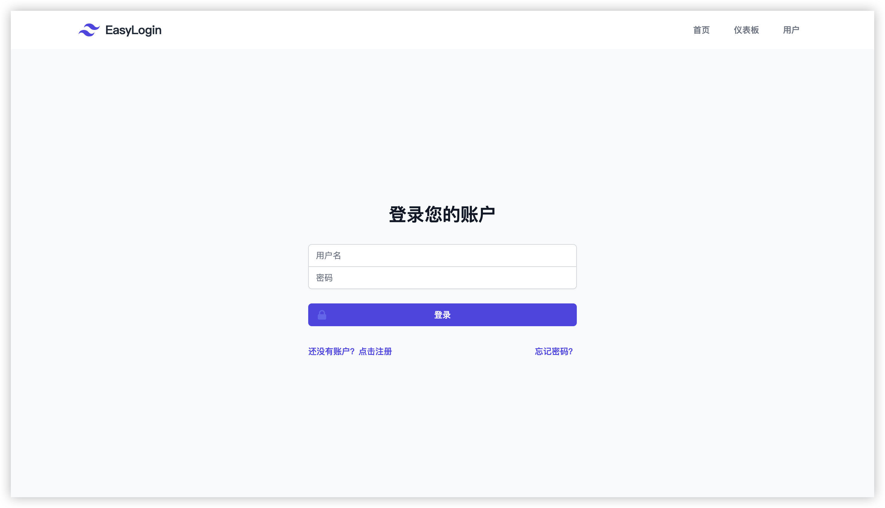
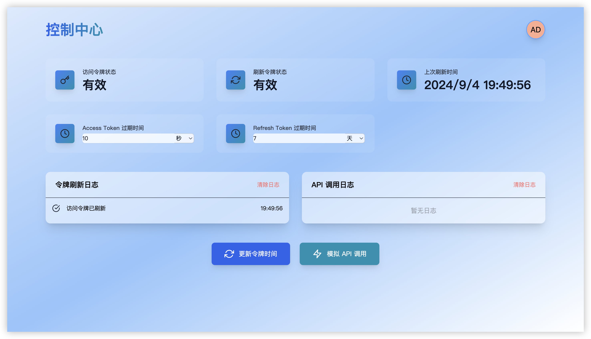

# EasyLogin: 高级 Vue 3 & Express 登录系统
## 项目截图

以下是 EasyLogin 系统的一些主要界面截图：

### 功能概览
EasyLogin 提供全面的用户认证功能，确保您的应用安全可靠。


### 登录界面
简洁直观的登录界面，提供用户友好的体验。


### 控制中心
强大的控制中心，实时监控系统状态和令牌信息。


### 个人信息
用户可以方便地查看和管理个人信息。


[](https://vuejs.org/)
[](https://expressjs.com/)
[](https://www.docker.com/)
[](https://opensource.org/licenses/MIT)

EasyLogin 是一个现代化、安全、可扩展的登录系统，采用 Vue 3 和 Express 构建，并使用 Docker 进行容器化部署。本系统提供全面的用户认证功能，包括注册、登录、令牌刷新、密码重置等，并具有优雅的用户界面和强大的后端支持。

## 📚 目录

- [主要特性](#-主要特性)
- [快速开始](#-快速开始)
- [技术栈](#-技术栈)
- [项目结构](#-项目结构)
- [详细功能](#-详细功能)
- [安全性](#-安全性)
- [配置](#️-配置)
- [开发指南](#-开发指南)
- [部署](#-部署)
- [测试](#-测试)
- [贡献](#-贡献)
- [许可证](#-许可证)
- [联系方式](#-联系方式)

## 🌟 主要特性

- 💻 响应式前端界面，基于 Vue 3 和 Tailwind CSS
- 🔐 JWT 认证，支持访问令牌和刷新令牌
- 🔄 无感刷新机制，提升用户体验
- 🛡️ 密码强度检测和安全存储
- 📊 用户仪表板，展示令牌状态和系统日志
- 🐳 Docker 支持，简化部署和环境管理
- 🔍 详细的系统日志，便于监控和调试

## 🚀 快速开始

### 前提条件

- Docker 和 Docker Compose
- Node.js (推荐 v20.16.0)
- pnpm 包管理器

### 使用 Docker 运行

1. 克隆仓库：
   ```bash
   git clone https://github.com/JoJo20040325/easylogin.git
   cd easylogin
   ```

2. 创建并编辑 `.env` 文件：
   ```bash
   cp .env.example .env
   ```
   根据需求修改环境变量。

3. 构建和运行 Docker 容器：
   ```bash
   docker-compose up --build
   ```

4. 访问应用：
   - 前端：http://localhost:8080
   - 后端 API：http://localhost:3000

## 📚 技术栈

### 前端
- Vue 3.4
- Pinia (状态管理)
- Vue Router
- Tailwind CSS
- Axios

### 后端
- Express.js
- MySQL
- JWT (jsonwebtoken)
- bcrypt (密码加密)

### 开发工具
- Vite
- ESLint
- Prettier

## 📂 项目结构

```
easylogin/
│
├── frontend/                # 前端 Vue 应用
│   ├── src/
│   │   ├── components/      # Vue 组件
│   │   ├── views/           # 页面视图
│   │   ├── store/           # Pinia 存储
│   │   ├── router/          # Vue Router 配置
│   │   └── utils/           # 工具函数
│   └── ...
│
├── backend/                 # 后端 Express 应用
│   ├── controllers/         # 路由控制器
│   │   ├── authController.js
│   │   └── userController.js
│   ├── models/              # 数据模型
│   │   ├── user.js
│   │   └── refreshToken.js
│   ├── routes/              # API 路由定义
│   │   ├── authRoutes.js
│   │   └── userRoutes.js
│   ├── middleware/          # 中间件
│   │   ├── authMiddleware.js
│   │   └── validationMiddleware.js
│   └── utils/               # 工具函数
│       ├── tokenUtils.js
│       └── errorHandler.js
│
├── docker-compose.yml       # Docker Compose 配置
└── README.md                # 项目文档
```

## 🔎 详细功能

1. **用户认证**
   - 注册新用户
   - 用户登录
   - 访问令牌和刷新令牌机制
   - 无感刷新实现

2. **用户管理**
   - 查看和更新用户资料
   - 更改密码
   - 删除账户

3. **安全特性**
   - 密码强度检查
   - JWT 认证
   - 防止暴力攻击的速率限制

4. **仪表板功能**
   - 显示令牌状态
   - 令牌刷新日志
   - API 调用日志

5. **其他功能**
   - 忘记密码 / 密码重置
   - 响应式设计，适配移动设备

## 🔒 安全性

- 使用 bcrypt 进行密码哈希
- JWT 用于安全的用户认证
- 实现了访问令牌和刷新令牌机制
- 全面的输入验证和 SQL 注入防护
- HTTPS 支持（在生产环境中配置）

## 🛠️ 配置

主要配置项在 `.env` 文件中，包括：

- `DB_HOST`: 数据库主机
- `DB_USER`: 数据库用户名
- `DB_PASSWORD`: 数据库密码
- `DB_NAME`: 数据库名称
- `JWT_SECRET`: JWT 签名密钥
- `JWT_REFRESH_SECRET`: 刷新令牌签名密钥
- `PORT`: 后端服务器端口
- `FRONTEND_URL`: 前端应用 URL

请确保在生产环境中使用强密钥和安全的配置。

## 💻 开发指南

### 本地开发

1. 前端开发：
   ```bash
   cd frontend
   pnpm install
   pnpm run dev
   ```

2. 后端开发：
   ```bash
   cd backend
   pnpm install
   pnpm run dev
   ```
   
## 🚢 部署

1. 确保已安装 Docker 和 Docker Compose。
2. 修改 `.env` 文件中的配置，适应生产环境。
3. 运行以下命令启动服务：
   ```bash
   docker-compose up --build
   ```

## 🧪 测试

运行测试套件：

```bash
# 前端测试
cd frontend
pnpm run test

# 后端测试
cd backend
pnpm run test
```

## 🤝 贡献

我们欢迎所有形式的贡献，无论是新功能、bug 修复还是文档改进。请遵循以下步骤：

1. Fork 项目
2. 创建您的特性分支 (`git checkout -b feature/AmazingFeature`)
3. 提交您的更改 (`git commit -m 'Add some AmazingFeature'`)
4. 推送到分支 (`git push origin feature/AmazingFeature`)
5. 创建一个 Pull Request

## 📄 许可证

本项目采用 MIT 许可证。详情请见 [LICENSE](LICENSE) 文件。

感谢您对 EasyLogin 项目的关注！我们期待您的反馈和贡献。

